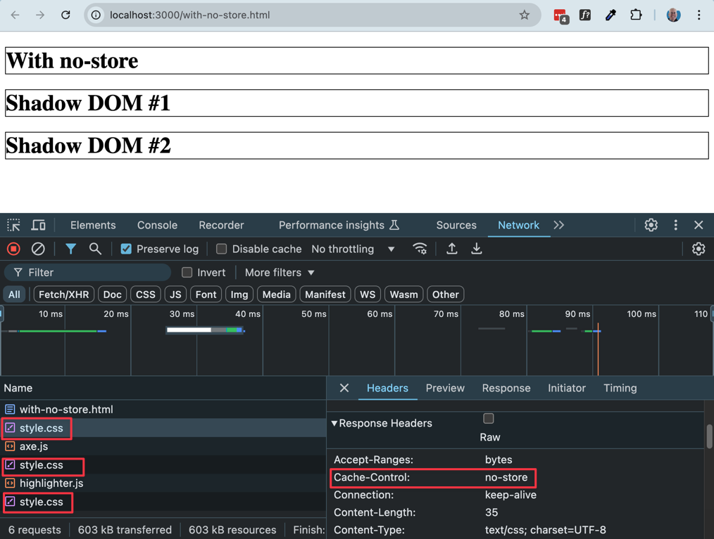
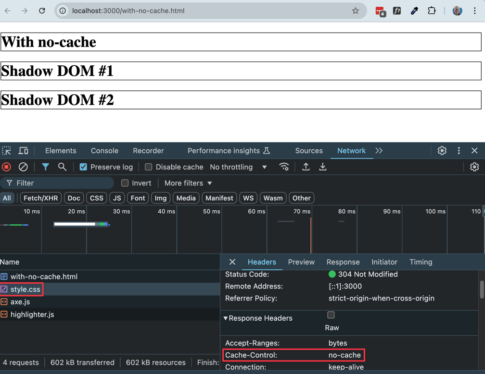
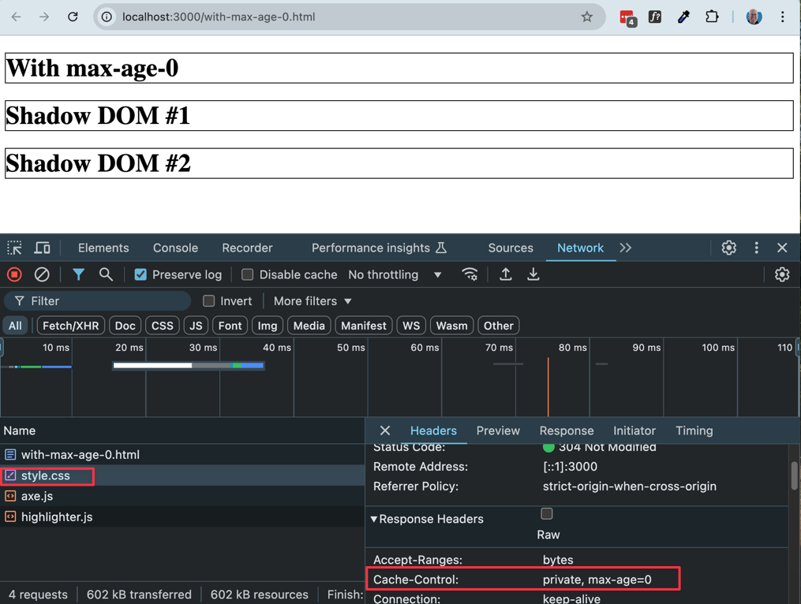
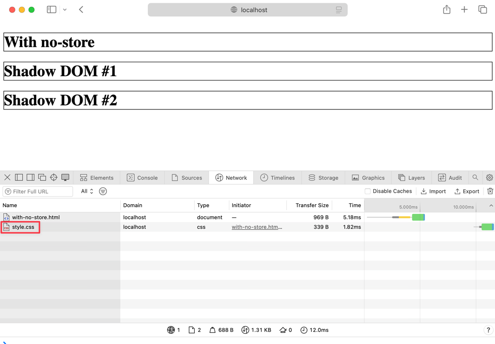
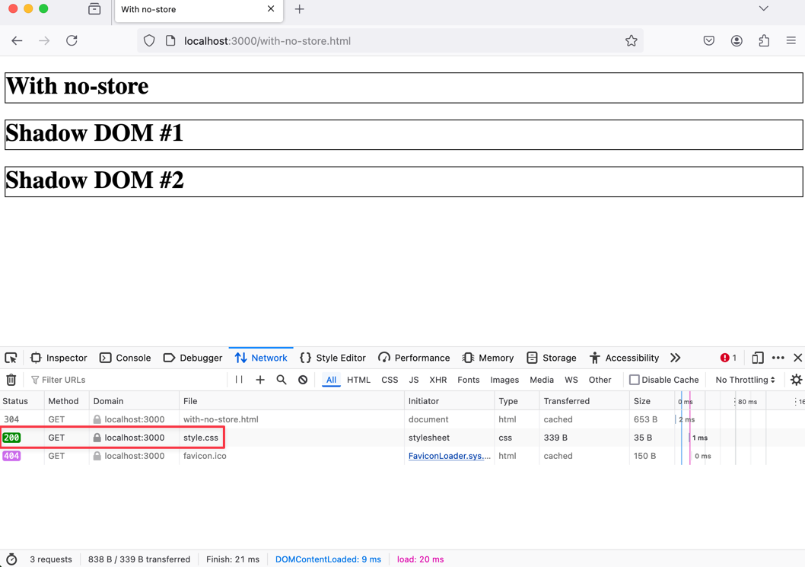

# Declarative Shadow DOM CSS Links Cache-Control Test

This repository demonstrates the use of Declarative Shadow DOM (DSD) in HTML to test how many times CSS files are network-loaded when referred to with `<link rel="stylesheet">` inside a declarative shadow DOM enabled element.

```html
<host-element>
    <template shadowrootmode="open">
        <link rel="stylesheet" href="style.css">
        <h1>Shadow DOM #1</h1>
    </template>
</host-element>

<host-element>
    <template shadowrootmode="open">
        <link rel="stylesheet" href="style.css">
        <h1>Shadow DOM #2</h1>
    </template>
</host-element>
```

## Files

- `index.html`: The main entry point that links to different examples of DSD.
- `with-no-cache.html`: An example of a custom element with a declarative shadow DOM and a `Cache-Control` header set to `no-cache`.
- `with-no-store.html`: An example of a custom element with a declarative shadow DOM and a `Cache-Control` header set to `no-store`.
- `with-max-age-0.html`: An example of a custom element with a declarative shadow DOM and a `Cache-Control` header set to `max-age=0`.
- `style.css`: The CSS file linked in the shadow DOMs to style the content.

## Purpose

The purpose of this repository is to test how many times `style.css` is network-loaded when it is referred to with `<link rel="stylesheet">` inside a declarative shadow DOM enabled element. This helps in understanding the caching behavior of CSS files linked to inside declarative shadow DOM with different cache-control settings.

## Usage

1. **Clone the repository**:
   ```sh
   git clone https://github.com/your-username/declarative-shadow-dom-example.git
   cd declarative-shadow-dom-example
   ```

   2. Install dependencies:

   ```sh
   npm install
   ```

   3. Run the development server

   ```sh
   npm run dev
   ```

## Observations

In Chrome devtools, when cache-control is set to no-store, style.css is network-loaded each time it is referenced in a declarative shadow DOM.

If cache-control is set to no-cache or max-age=0, style.css is only network-loaded once (for the light DOM), and not network-loaded again when referenced from inside the declarative shadow DOM.

### no-store:



### no-cache:



### max-age=0:



However, for cache-control no-store, both Safari and Firefox network-load style.css only one time:

### Safari no-store:



###



Similar results in this [Code Sandbox example](https://q9yc7v.csb.app/), perhaps because Code Sandbox appears to set cache-control on css files to "private, max-age=0, no-cache, no-store".  In Chrome, style.css is loaded multiple times, but only once in Safari and Firefox.